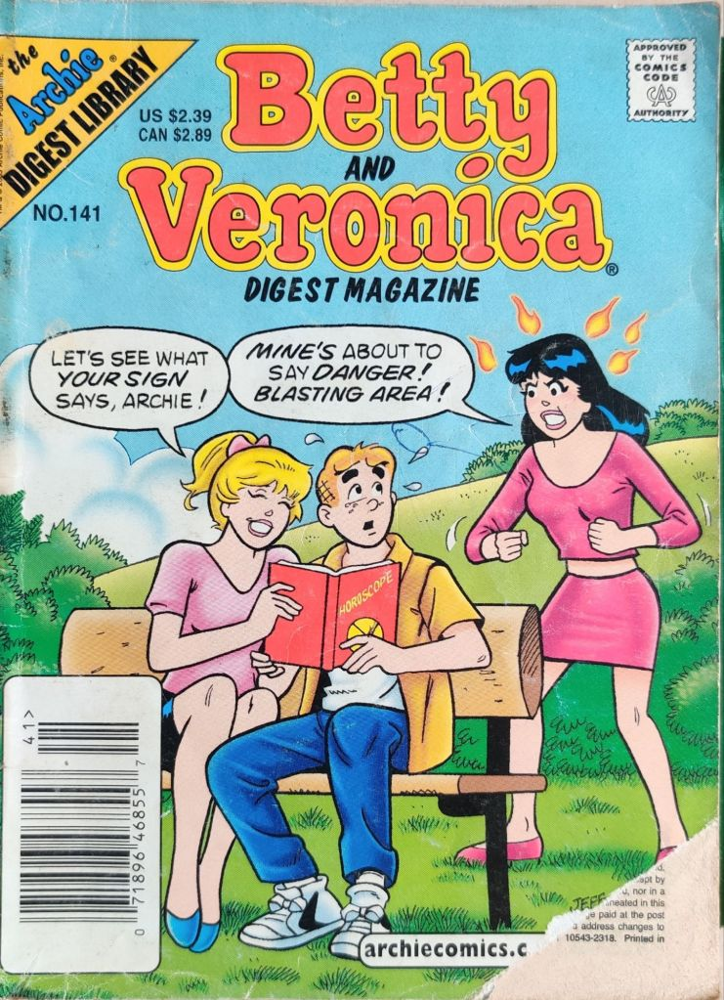
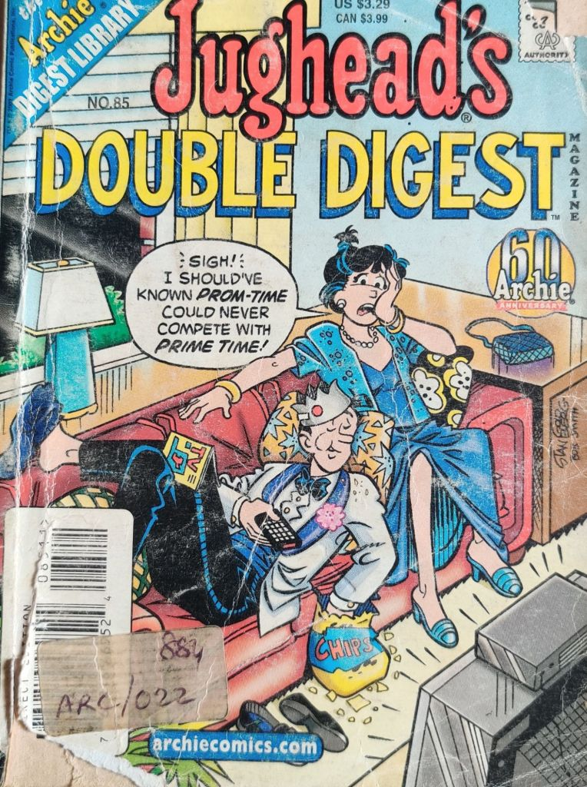
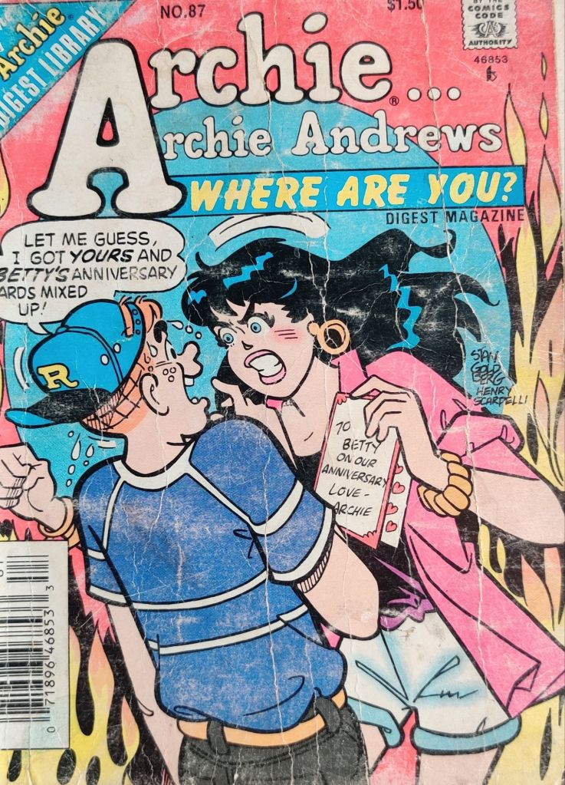

---
date : "2024-03-28T20:00:00+00:00"
draft : false
title : "Archies, The perinial teenagers"
tags: ['Culture', 'Growing Up', 'Love']
categories : ['Entertainment','Comics', 'Fiction']
---

The Archie comics were a favorite of many of us growing up in the sixties and seventies in India. It was a world very different from what we experienced. We lived in cramped apartments in Mumbai and Riverdale was a world of dreams and desires for us.

In the colorful realm of comic books, one town stands out as the epitome of small-town charm, drama, and quirky characters. Welcome to Riverdale, the fictional setting of the iconic Archie Comics. 

## A Brief History of Riverdale:

Archie Comics first burst onto the scene in 1941, created by writer Vic Bloom and artist Bob Montana. The series quickly gained popularity with its wholesome depiction of teenage life in a picturesque American town. Led by the freckle-faced, redheaded goofball, Archie Andrews, the comics introduced readers to a cast of characters that felt like old friends.

As the series evolved over the decades, it managed to stay relevant by tackling contemporary issues while still maintaining its signature charm. From the innocent hijinks of the ’50s to the melodramatic romances of the ’80s and beyond, Archie Comics has kept readers hooked with its timeless tales of friendship, love, and high school shenanigans.

## Meet the Gang:

At the heart of Archie Comics are its beloved characters, each with their own unique quirks and personalities:
- **Archie Andrews:** The perennially clumsy yet lovable protagonist whose perpetual indecision in matters of the heart makes him the ultimate teenage Everyman.
- **Betty Cooper:** The girl next door with a heart of gold and an unwavering loyalty to Archie, despite his constant obliviousness to her affections.
- **Veronica Lodge:** The wealthy, fashionable socialite whose on-again-off-again relationship with Archie keeps the romantic tension simmering in Riverdale.
- **Jughead Jones:** rchie’s laid-back best friend whose insatiable appetite for hamburgers is only matched by his aversion to anything resembling responsibility.
- **Reggie Mantle:** The smooth-talking prankster whose ego is as inflated as his collection of varsity jackets, Reggie is the perennial thorn in Archie’s side.
- **Cheryl Blossom:** The fiery-haired vixen whose arrival in Riverdale adds an extra dose of drama and competition to Archie and friends’ lives.
- **Moose Mason:** If brawn were brains, Moose would be valedictorian of Riverdale High. This towering titan may not be the sharpest brain in the shed, but his heart of gold and unwavering loyalty to his friends make him a beloved member of the Archie gang.
- **Midge Klum:** Moose’s sweetheart and the apple of his eye, Midge brings a touch of sweetness to Riverdale High. Despite Moose’s overprotective tendencies, Midge isn’t afraid to stand up for herself and prove she’s more than just a damsel in distress.
- **Dilton Doiley:** The resident genius of Riverdale, Dilton’s inventions and scientific experiments often lead to hilariously disastrous results. Whether he’s building a robot girlfriend or trying to solve the mysteries of the universe, Dilton’s boundless curiosity and enthusiasm never fail to entertain.
- **Hot Dog:** Every dog has its day, but Hot Dog seems to have them all. Jughead’s faithful canine companion is always by his side, whether they’re scarfing down burgers at Pop’s or embarking on misadventures around town. With his laid-back attitude and insatiable appetite, Hot Dog proves that sometimes the best friends come in furry packages.
- **Big Ethel:** Gawky, clumsy, and desperately wanting to belong to the gang. Her pursuit of Jughead was the hook to her character. But it also touches your heart.
 
From Moose and Midge’s tumultuous romance to Dilton’s madcap experiments and Hot Dog’s canine capers, these characters add an extra layer of humor and heart to the rich tapestry of life in Riverdale. So whether you’re dodging Moose’s accidental hugs or marveling at Dilton’s latest invention gone awry, there’s never a dull moment in the world of Archie Comics.

The characters are over the top and much of the action was cringe in hindsight. But it was enjoyable then and it is enjoyable now. All you have to do is stop thinking and just feel the flow and enjoy. Much like what teenage is all about.

But just stop and think, don’t we all know characters who have some similarities with the folk in the Archies? That’s what made the Archies popular, they were all human and universally so.

## International Influence:

While Riverdale may be a fictional town, its influence extends far beyond the borders of the United States. Archie Comics has been translated into numerous languages and adapted into various media formats, including animated series, live-action TV shows, and even a hit Netflix drama.

From Japan to Italy, fans around the world have fallen in love with the relatable characters and timeless stories of Archie Comics. The universal themes of friendship, romance, and coming-of-age resonate with audiences of all ages and cultures, cementing the series’ status as a global pop culture phenomenon.

So whether you’re a die-hard Archie fan or a newcomer to the world of Riverdale, there’s always something to love in the pages of Archie Comics. So grab a copy, kick back, and immerse yourself in the delightful, humorous world of Archie and his friends. After all, in Riverdale, anything is possible—even if it’s just a little bit absurd.

