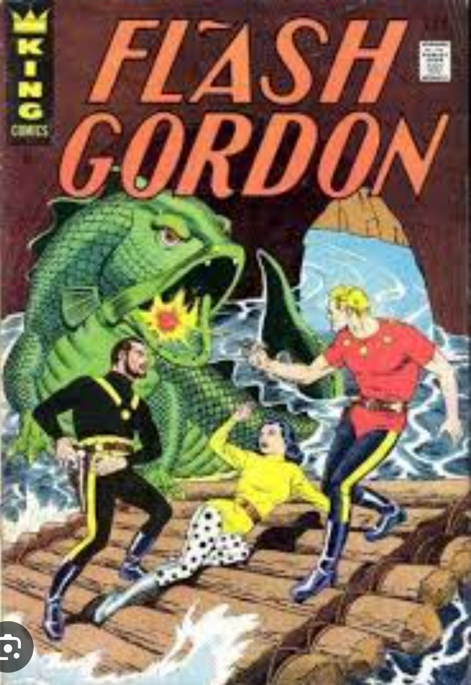
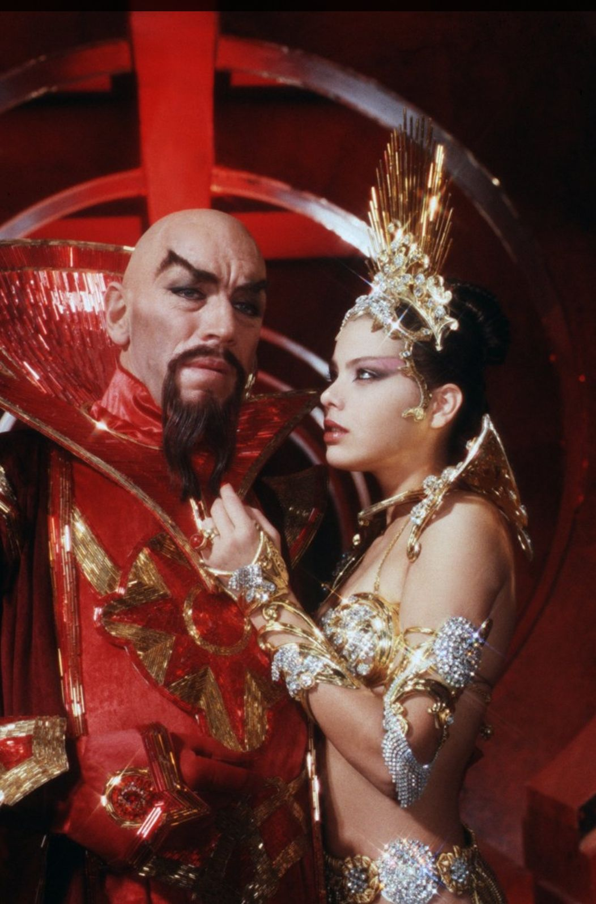
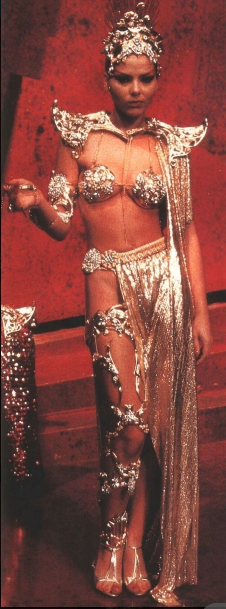
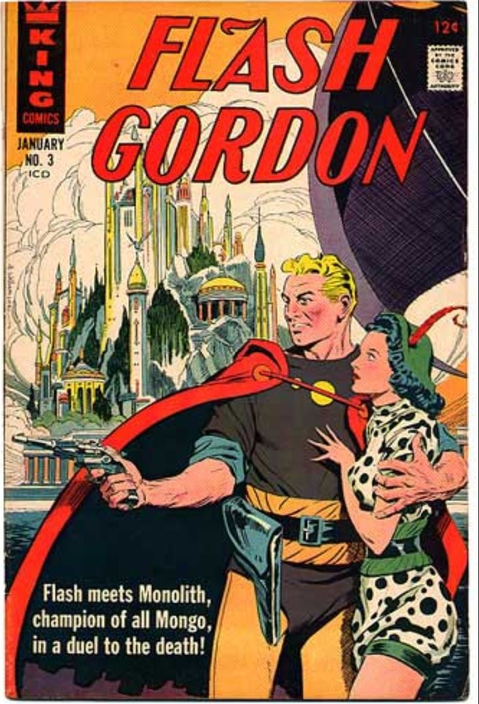
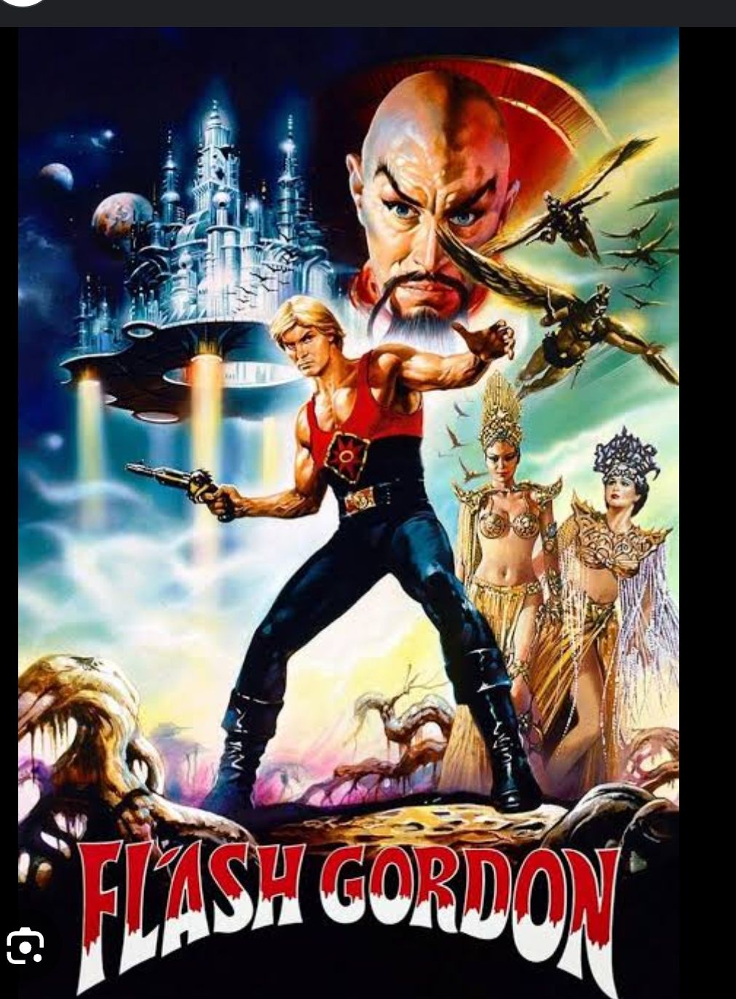

---
date : "2024-03-22T20:00:00+00:00"
draft : false
title : "Flash Gordon: A Galactic Space opera."
tags: ['Space', 'Adventure', 'Sci Fi']
categories : ['Entertainment','Comics', 'Fiction']
---

In the vast cosmos of comic book heroes, there’s one character who rockets above the rest with style, panache, and a healthy dose of campiness – Flash Gordon. Born out of the era of pulp sci-fi, Flash Gordon has endured through the ages, leaving a trail of entertainment,  laughter, and adventure in his wake.

Flash Gordon rocketed onto the scene in 1934, created by Alex Raymond. He was the all American hero, square-jawed, heroic archetype – a polo player and Yale graduate thrust into the depths of space, battling the villainous Ming the Merciless and his legions of strange creatures.

Originally debuting in a comic strip, Flash Gordon quickly expanded into other media, including radio serials, film serials, and eventually a cult classic film in 1980, complete with a killer soundtrack by Queen.

Over the decades, Flash Gordon evolved from a straightforward pulp hero to a tongue-in-cheek icon of campiness. The original comic strips were serious affairs, but as time went on, Flash’s adventures became increasingly absurd and self-aware.

The 1980 film adaptation, directed by Mike Hodges, embraced the over-the-top nature of the source material, featuring outlandish costumes, cheesy dialogue, and a healthy dose of space opera melodrama. It’s a film that’s as beloved for its campiness as it is for its imaginative world-building.

Ming the Merciless 

While Flash Gordon may be the titular hero, he’s surrounded by a colorful cast of characters that add depth and humor to his adventures. In fact Flash is overshadowed by them many a time.

Princess Aura

- **Dale Arden:** Flash’s love interest and constant companion, Dale is more than just a damsel in distress. She’s resourceful, courageous, and always ready to join Flash in battling the forces of evil.
- **Dr. Hans Zarkov:** The eccentric scientist who first discovers the threat of Ming the Merciless and recruits Flash and Dale to help him save Earth. Zarkov’s madcap inventions and brilliant mind often provide the key to defeating Ming’s schemes.
- **Ming the Merciless:** The iconic villain of the series, Ming is the tyrannical ruler of the planet Mongo. With his distinctive Fu Manchu mustache and penchant for megalomaniacal monologues, Ming is the perfect foil for Flash’s heroics. Ming became a favorite of many, and many Bollywood villains have copied his style.
- **Aura:** Princess and Daughter of Ming is another of my favorites. Beautiful, passionate, headstrong and fiercely independent. She changes as the series progresses. She dares to oppose her father, fall in love with Flash, changes her nature and aligns with the forces of good. She is much more strongly drawn than the heroine Dale.

One of the factors that made the Flash Gordon series different was the strongly drawn other characters who held their own.

Flash Gordon may have started as a serious pulp hero, but over the years, he’s embraced his campy side with gusto. From the pages of comic strips to the silver screen, Flash and his cohorts have delighted audiences with their absurd adventures and outlandish antics.

So the next time you find yourself in need of a cosmic pick-me-up, look no further than Flash Gordon. Whether he’s battling Ming the Merciless or simply hamming it up with his friends, Flash is always ready to take you on a wild ride through the stars. And remember, in the words of Queen: “Flash! Ah-ah! Savior of the universe!”

