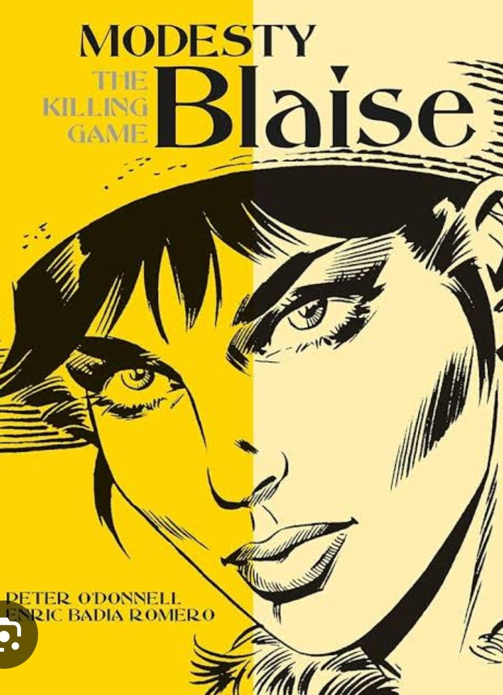
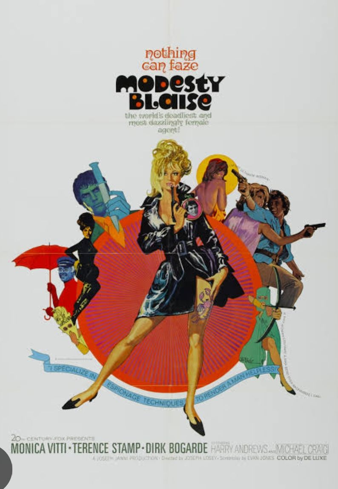
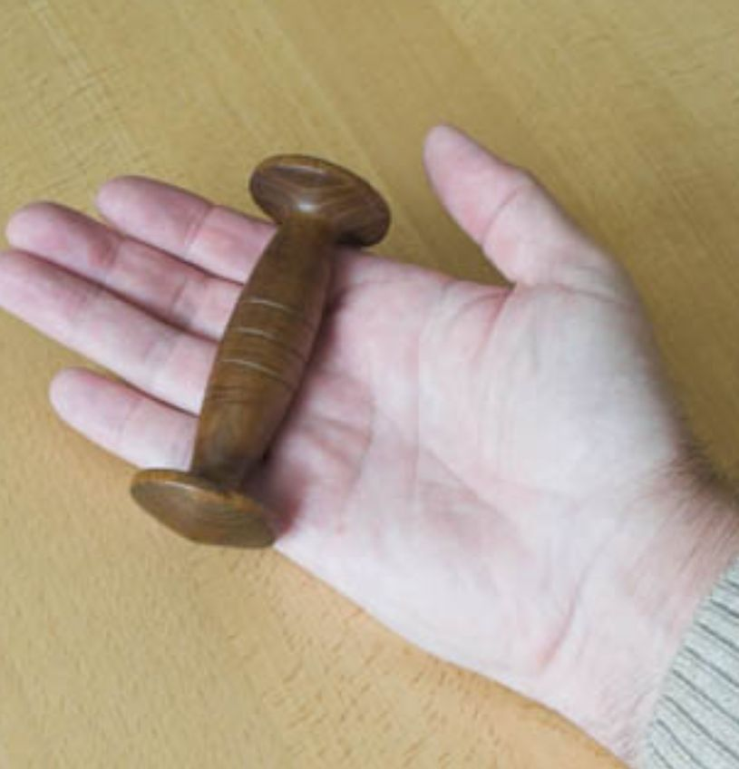
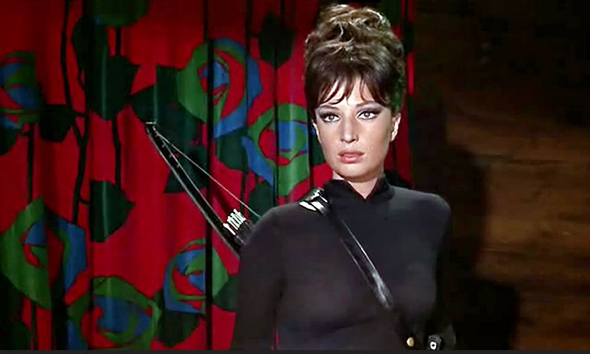
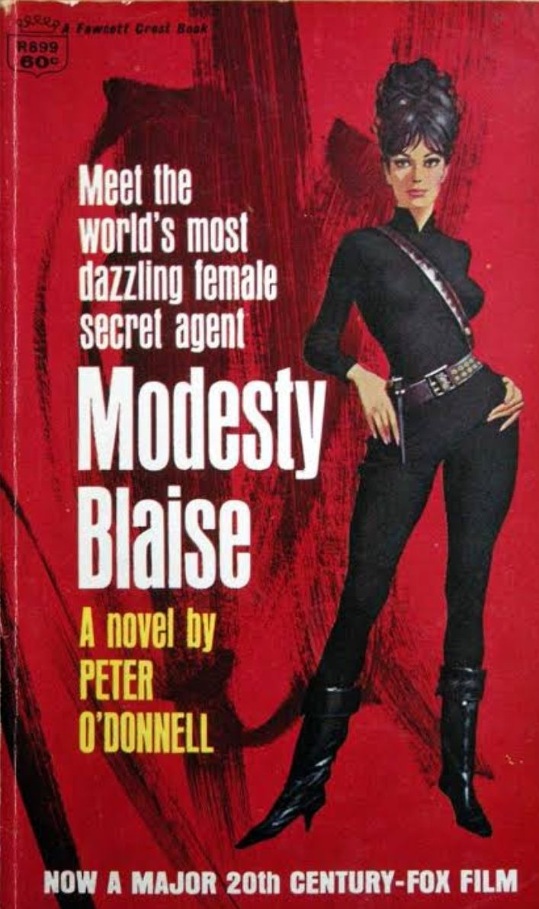
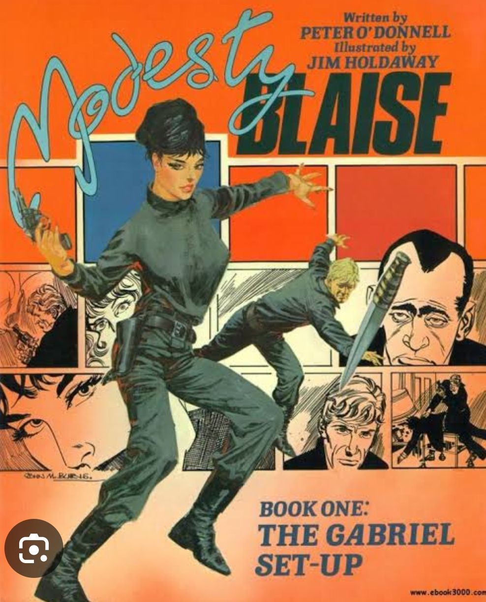

---
date : "2024-03-23T20:00:00+00:00"
draft : false
title : "Modesty Blaise: Femme Fatale Flair!"
tags: ['Culture', 'Adventure', 'Heroine']
categories : ['Entertainment','Comics', 'Fiction']
---

In the annals of adventure fiction, there exists a name that sizzles with intrigue, charm, and a hint of danger: Modesty Blaise. Crafted by the ingenious mind of British writer Peter O’Donnell, Modesty Blaise exploded onto the scene in 1963, captivating readers with her tantalizing escapades and razor-sharp allure. The sixties were a period of rebellion, hippies, and sexual freedom and exploration. An apt time for the world of Modesty Blaise, where espionage meets elegance, and passion pirouettes with prowess.

Modesty Blaise was different, the heroine is not modest but rather in your face. She has numerous lovers and is sexually active. Her sidekick is Willie Garvin and Willie is slang for penises in colloquial English. He too is sexually active changing partners frequently. Sex in this series was recreational and casual. And yet it is never explicit or obscene.

## A Brief Introduction to Modesty:

At the end of WW2, a nameless, stateless orphan from Greece turned refugee turned crime boss turned globetrotting seductress. That’s  Modesty Blaise’s backstory. It is a steamy romp through the Mediterranean, with detours in Tangier and destinations beyond. Raised amidst the tumultuous whispers of the underworld, Modesty honed her skills in combat, espionage, and the art of seduction. With her enigmatic confidant Willie Garvin by her side, she traverses the globe, entangling hearts and unraveling mysteries with a flick of her perfectly coiffed hair.

Once she has made her millions she has a marriage of convenience and becomes British. She lives in a London penthouse and has homes in Tangier and Wiltshire. Bored with the rich life she is approached by the British Secret Service and soon Modesty and Willie are back in action. 

## Bond… Modesty Bond?

Now, you might be pondering, “Isn’t Modesty Blaise just a sultry James Bond?” Ah, no let’s unravel that mystery quicker than Bond downs a shaken martini. 

While both inhabit the world of espionage and allure, Modesty Blaise is in a league of her own. She’s not just a temptress; she’s a temptress extraordinaire. Unlike Bond, whose charm often teeters on the edge of caricature and campiness, Modesty exudes a quiet sensuality paired with a deadly skill set. She doesn’t rely on gadgets or gimmicks; she wields her feminine wiles, her lethal charm, and the occasional tantalizing innuendo. She is also a master, er no mistress of unarmed combat, her favorite weapon being the Yawara stick which she also uses to tie up her long lustrous hair.

A Yawara Stick.

## Similarities? Perhaps…:

Certainly, both Modesty and Bond share a taste for high-stakes adventure and seductive intrigue. They navigate a world of shadowy organizations, nefarious villains, and glamorous locales with a flair that leaves hearts racing and pulses pounding. But where Bond is the epitome of British suaveness and sophistication, Modesty brings an international allure and a hefty dose of feminine power to the equation. She is the girl who outperforms Bond both in and out of the bedroom.

From the 1966 movie

## The Legacy Lives On:

Though Modesty Blaise may no longer grace the pages of comic strips, her legacy thrives through novels, films, and the smoldering imaginations of fans worldwide. She remains a beacon of seduction, a symbol of strength and sensuality in a world where danger lurks in every shadow. So, the next time you find yourself craving adventure with a side of allure, look no further than Modesty Blaise. She may not boast a license to kill, but she certainly holds a license to thrill.

Modesty Blaise is more than just a character; she’s an enigma—a seductive force to be reckoned with and a reminder that in a world of spies and secrets, it’s not just about saving the day; it’s about doing it with irresistible charm and unapologetic allure.

