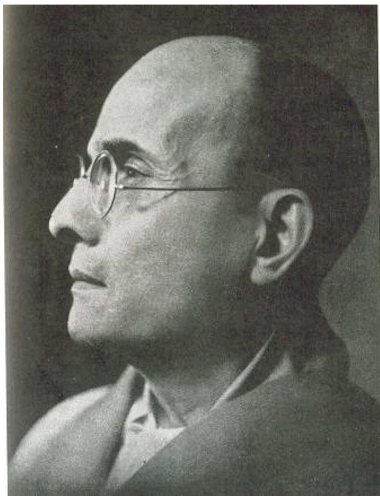
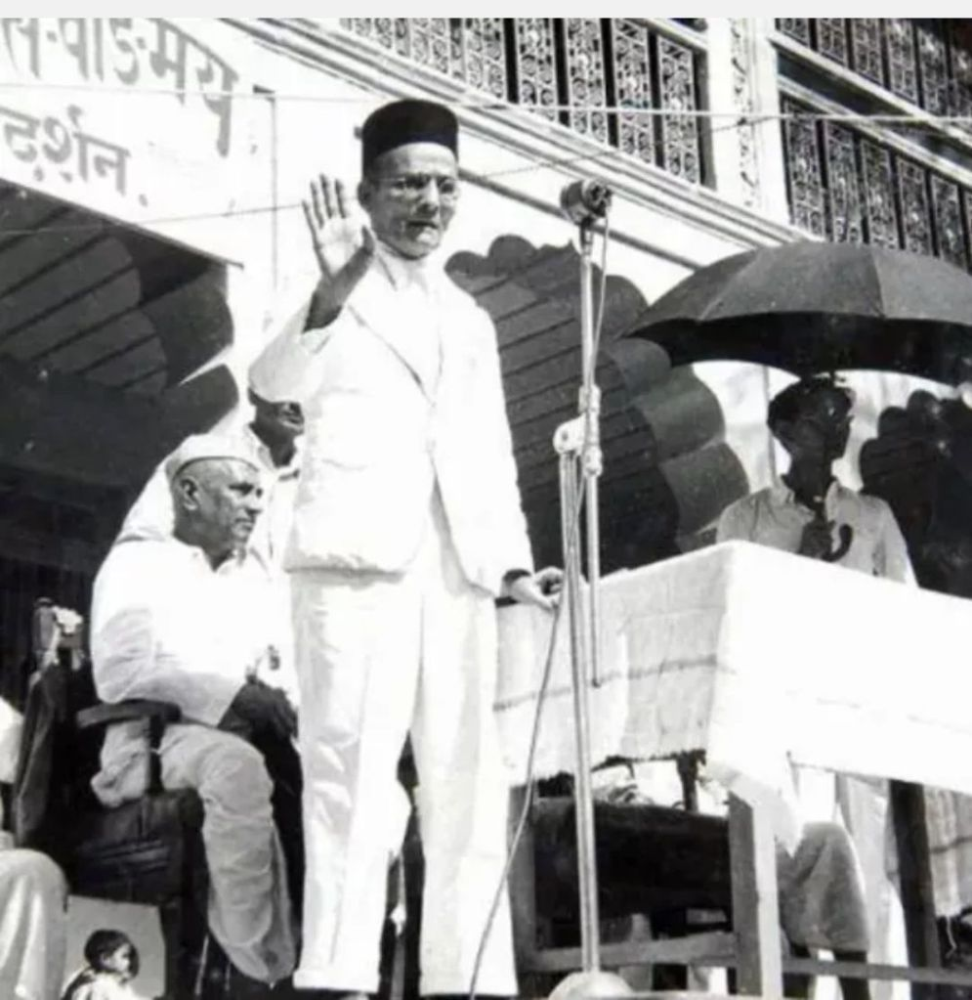
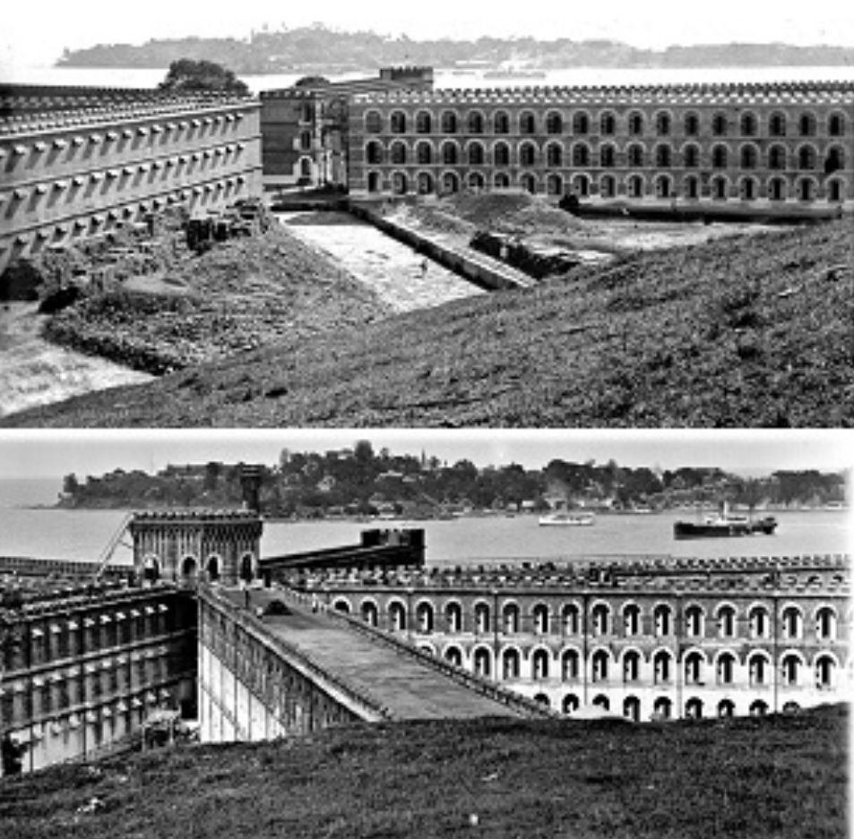
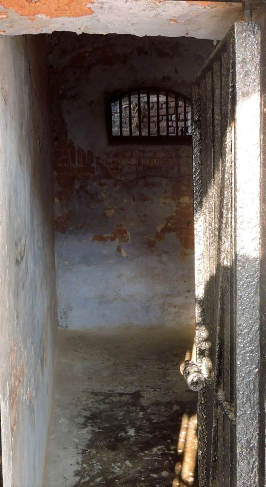

---
date : "2024-05-28T20:00:00+00:00"
draft : false
title : "Savarkar"
tags: ['British Empire', 'Indian Freedom', 'Prison', 'Revolutionary', 'Veer Savarkar']
categories : ['British History', 'Education', 'History', 'Indian History', 'Non fiction']
---

Savarkar

On 28th May 1884 was born a man who personified revolution with his focus and passion, Vinayak Damodar Savarkar, or as he is popularly known, Veer Savarkar.

There are many myths and misconceptions about him. And sadly he is not given his due as a freedom fighter, as a revolutionary who inspired the young men of his era and instilled fear in British hearts.

His active years as a revolutionary were between 1900 and 1912 much before the Gandhi era.

Savarkar was highly educated and was in London pursuing higher studies when he was arrested for his revolutionary activities.

He had been influenced by Bal Gangadhar Tilak’s ideas and in London he was exposed to the revolutionary concepts of the Irish freedom fighters and was deeply influenced by Giuseppe Mazzini, the Italian activist and revolutionary. Savarkar even translated Mazzini’s autobiography into Marathi.

Savarkar giving a speech

Savarkar was highly intelligent and a brilliant student and his early ambition was to get a good education and be intellectually influential. He was also from a very early age exposed to the ideas of Indian freedom and wanted to be a part of the freedom movement.

He came from a family who were social activists and also votaries of Indian freedom. Thus from an early age, Savarkar was exposed to ideas of freedom and social activism.

He was a very strong opponent of the caste system and throughout his life worked to remove caste prejudices. He set up schools, and celebrated festivals with people from all castes. He set up Ganeshutsav mandals where the worship was done by people who belonged to the Dalit community. His actions were opposed by his community of Brahmins and other Hindus. His advocacy of women’s freedom, rights, and education also drew flak from many. But Savarkar stood steadfast in his beliefs.

But all this was much later. In London Savarkar involved himself in his studies and also in the activities of India House which was a hub of Indian Student activists.

It was here, in London, in 1909, that he wrote his famous work on what was till then called the Sepoy Mutiny. Savarkar wrote in detail about this and called it the first United uprising against British rule. He termed it the “First War of Indian Independence”. It was a revolutionary concept and brought him to the notice of the authorities.

He also formed a secret society called the Abhinav Bharat Society whose aim was freedom from Britain and armed revolution if required to achieve it.

In 1909 Savarkar, was arrested in London for his revolutionary activities and alleged role in the murder of the murder of A.M.T. Jackson, the Nashik Collector, in India.

The ship carrying Savarkar docked in the French port of Marseille and Savarkar escaped through the port hole of his locked cabin and swam to the shore. He planned to seek asylum in France.

But the British sailors saw him escaping and immediately advised the local authorities who captured him within half an hour. The British from the ship then arrested him again. But this arrest was on French soil and was contested by the Indian revolutionaries. It created an international incident that was embarrassing to the British and made Savarkar famous.

There were protests from Indian and International personalities and the French and British engaged in diplomatic discussions.

Finally, the International Court of Arbitration at Hague ruled in favour of the British and Savarkar was extradited to India.

It was 1910 and the memory of 1857 was still fresh in British minds. There was no common movement for Indian freedom which would come years later after Gandhiji took the issue to the masses.

The British dealt harshly with freedom fighters especially those who were in support of an armed revolution.

Savarkar was treated very harshly and was sentenced to two terms of imprisonment at the dreaded prison at Andaman, the dreaded Kala Pani.

Savarkar was sent in 1911 to this prison from which very few came back alive. Make no mistake the British did not want him back alive in India. This was a prison that was worse than many penal settlements around the world. s based crematoriums the process is quicker, cheaper and more eco-friendly.

An old photo of the cellular jail.

Though the French Penal settlement called Devil’s Island would become notorious as hell on Earth, the conditions at the British penal settlement at Andamans were worse.

The British started to send prisoners to Andamans after 1857. There was no fixed jail as such but prisoners were sent there as it would be difficult to return to the mainland. Also it was a remote group of islands and what happened there rarely got out. The prisoners were subjected to torture, poor food, and forced labor. Few survived.

A prison cell at the Cellular jail

As more people involved in the fight for freedom got transported to the Andamans the British decided that the punishment of transportation was not enough and in the 1890s the idea of a cellular prison was mooted and that the prisoners who got transported would need harsher treatment as a determent to the revolutionaries.

By the time Savarkar arrived at the Cellular prison in 1911, it was already notorious as a prison from which few returned alive or sane.

There was torture, poor food, forced labor, isolation, and deprivation which resulted in most inmates losing all hope. Savarkar, then a young man of 28 was sentenced to fifty years in this hell hole.

He would remain there till 1921 after which he was brought back to the mainland and imprisoned at Ratnagiri.  He was released on 6th January 1924 subject to strict conditions which if broken would lead to him being sent back to the Andamans.

He had spent the prime of his life in the Andaman hell hole. His body was broken and his health was affected but his spirit was not broken. That mind of his was still strong and focused. He was still totally committed to Indian freedom and social reform.

He knew he would not survive another term of prison and so had to be careful and walk a tightrope. All those who blame him for his mercy petitions have no idea of what he underwent or his focus on his goals and his sacrifices.

No man is perfect and Savarkar had his faults but no one can deny he was a great freedom fighter and a very brave man truly deserving of the term “Veer” which means brave.

Jai Hind and Namaste. 🙏

