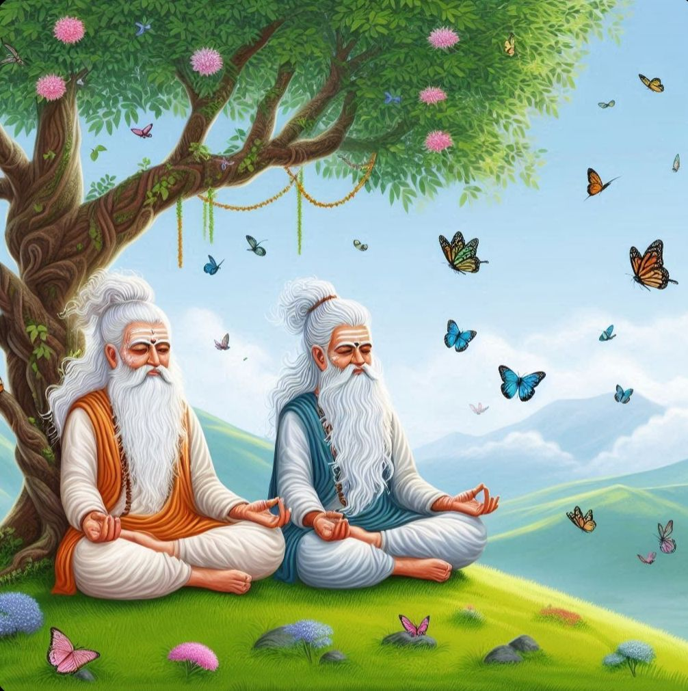
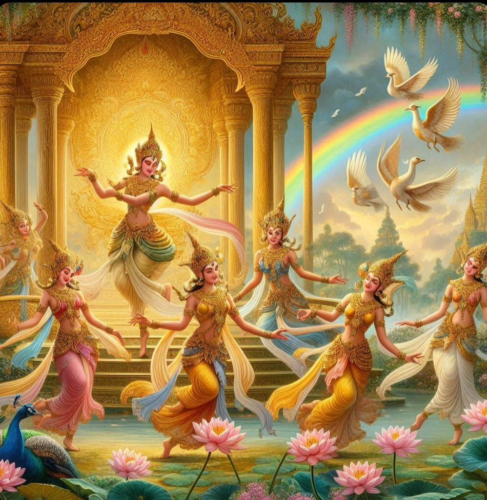

---
date : "2024-06-25T20:00:00+00:00"
draft : false
title : "Sexuality and the Apsara. The birth of Urvashi."
tags: ['Karma','Hinduism','Indian Culture']
categories : ['History','Non Fiction','Indian Mythology']
---

We looked at spirituality in the earlier blog and Indian Philosophy is full of spiritual advice and we have many persons pontificating about spirituality. India, they claim, is a spiritual land.

How boring it all seems sometimes when we hear the frequent admonishments, restrictions, and what have you. Did our ancestors really tell us to lead drab and dull lives? Was sex taboo, a necessity for just procreation?

No, all these ideas came to us over the ages, from the Abrahamic faiths and mostly from the Puritanic British rule and the other colonial powers and the missionaries. The British, who are one of the most hypocritical societies in the world, when they first began to rule did not want an intermingling of the races. This led to segregation and the idea of sex as one of duty rather than pleasure. Having a native wife was taboo and the Indian elite, happy to ape the rulers as always, began to follow suit. Yes we had the Maharajas and the Nawabs who still indulged in their passions but overall society became repressed over time.

The North of India was already a highly patriarchal and repressed society. The frequent invasions and the Moslem influence had created a culture different from the original Sanatan culture.

Our ancestors recognized that sex was important. The basic tenets of life were Dharma, Artha, Kama and Moksha.

Dharma was doing the right thing. Artha was an accumulation of wealth, Moksha was liberation from rebirth and Kama was desire or the fulfillment of desires mostly sex.

The goal of marriage was to beget a male heir, one who would do the required Karmas so that we get Moksha. It was considered so important that there were sanctioned ways to get an heir even outside marriage.

It was also recognized and recommended that pleasure had to be mutual and so the ancient treatises discussed the methods of how to please your partner. Pleasure was not just a male prerogative but women equally had the right to seek pleasure in a relationship. So unlike most other faiths, Hinduism recognizes that sexual pleasure is a part of life. In fact, in ancient times women also had the choice to leave their partner and seek another.

But Kama is not just sex, it is a recognition that life is made up of many activities that give us a sense of pleasure. So music, dance, and the other arts were all an important part of life.

So you had the Gandharvas, the Celestial Musicians and you had the Apsaras the divine dancers.

Both Gandharvas and Apsaras were considered divine beings who were to be respected and who had powers beyond mere mortals.

The Apsaras are an interesting group. They are so beautiful that they can entice anyone. They are accomplished dancers and they are seductive knowing all the secrets of love.

Most of the Apsaras came out during the churning of the ocean, so they are water nymphs in a way.

Urvashi, one of the most famous Apsara has a different origin.

Urvashi is said to have been born as a full-grown maiden from the thigh of the Rishi Narayana.

The sages Nar and Narayana are in deep meditation at Kedarnath. Indra, the King of Gods is worried, that the two sages have accumulated great power through their austerities. He fears they could take over his Kingdom. Indra is always insecure.

Nar and Narayana

He sends his Apsaras including Menaka, Rambha, and Tilottama to distract the sages from their meditation. Kamadeva the God of love and Rathi his wife accompany the Apsaras.

The Apsaras, proud of their beauty and talent dance and sing seductively in front of the two Rishis. Rathi and Kamadeva create an enchanting atmosphere. You could say they are the event managers and choreographers.

The dancing Apsaras.

But the rishis are unmoved and after sometime tired of the tamasha and noise created. They decide to break the pride of the Apsaras.

Narayana slaps his thigh and a maiden arises from it. She is beautiful and a more accomplished dancer than the Apsaras.

The Apsaras stop their activities, ashamed of themselves and Indra is summoned. Nar and Narayana advise Indra that they have no interest in his kingdom. Indra is happy to hear that and also enamored of the beautiful maiden who has arisen from Narayana’s thigh. The maiden is called Urvashi as she comes from the thigh ” Ur” the thigh of Narayana and she becomes the most beautiful and famous Apsara in Indra’s court.

Namaste until the next time. 🙏

