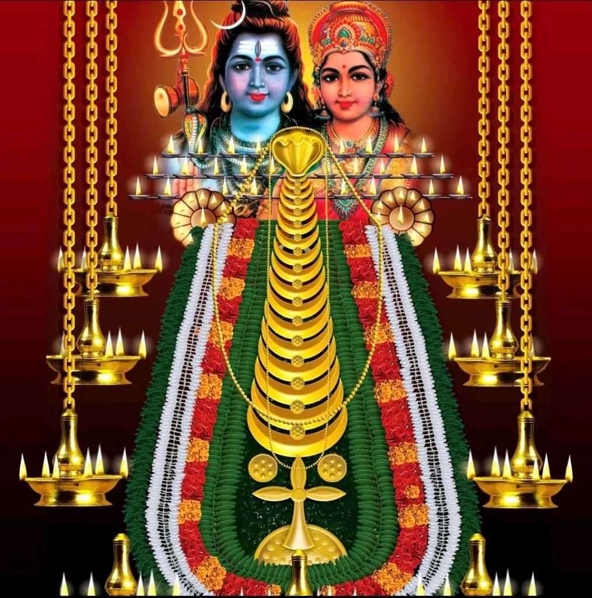
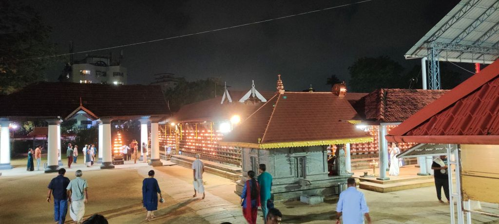
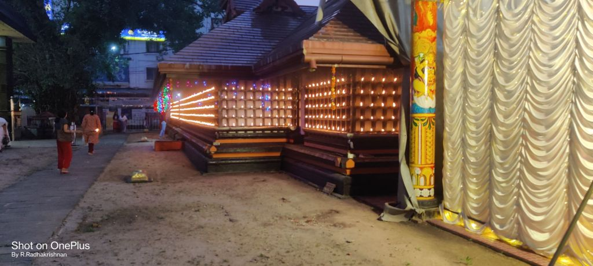
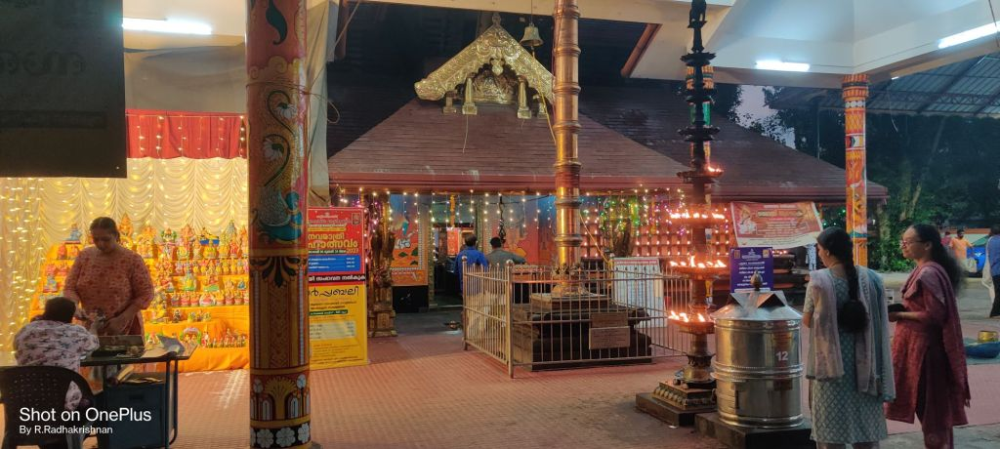
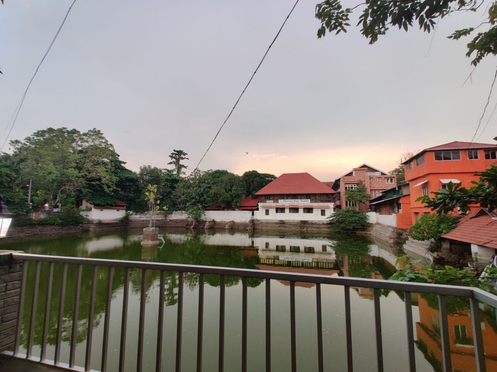
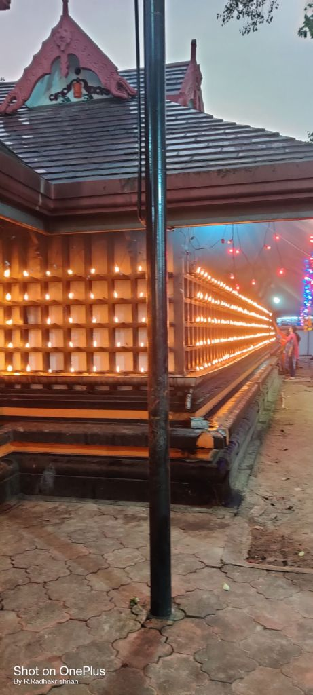

---
date : "2024-05-08T20:00:00+00:00"
draft : false
title : "The Legends of Kerala : The Ernakulam Shiva Temple. Or how Ernakulam got its name."
tags: ['Mahabharata',Hinduism','Indian Culture','Temples']
categories : ['Folk Stories','Kerala','India']
---

The main deity 

Once upon a time, Ernakulam was a sleepy little town lapped by the waters of the Arabian Sea.

Today it is the commercial capital of Kerala, a self-obsessed bustling town that seems to always be in a bit of a hurry.

At the centre of the town overlooking the Arabian Sea is the temple of Shiva which we call the Ernakulathappan temple. This is because the deity here is considered to be the guardian of the town. 

It is located on the Durbar Hall grounds or you can say it the other way around also, the Durbar Hall is located on the temple grounds.

The main entrance

Night time view 

Local legends link the temple with a story in the Mahabharata.

Arjuna, the Pandava, went to the forest and prayed to Lord Shiva. He did penance and austerities to please Shiva so that he would be blessed with divine weapons by Shiva. Arjuna knew war with the Kauravas was imminent and the divine weapons of Shiva would help him win against the Kauravas.

Shiva was pleased with Arjuna and decided to help him. But Shiva was also a God who liked to play pranks on his devotees so he disguised himself as a Kirata, a forest-dwelling hunter and his wife Parvathi disguised herself as a Kirata woman.

Arjuna was in his prayers when Shiva and Parvathi strolled near him in their disguised form.

As Arjuna looked up, annoyed at being disturbed at his prayers, suddenly a huge wild boar charged into sight.

Arjuna grabbed his bow and shot an arrow at the boar. The Kirata, too, shot an arrow from his bow. Both arrows hit the Boar and it collapsed and died. As it died the boar took the form of the Asura Muka.

The Kirata smiles at Arjuna and says “You are lucky I shot in time and killed the Asura”.

Arjuna is annoyed, the forest dweller not only disturbs his prayers but has the effrontery to claim a kill which is rightfully Arjuna’s.

Arjuna angrily refutes and the Kirata calls him arrogant and insists the boar was killed by his arrow. The dispute escalates and the Kirata suggests that they settle it by a duel.

Arjuna, confident as the world’s best Archer sneers and picks up his bow. A furious fight ensues. The gods watch in amazement as Arjuna brings all his skills into play.

Arrows fly thick and fast from his bow,  dust storms are created. But amidst all the chaos the Kirata stands smiling and untouched. He counters all of Arjuna’s attacks with ease and handles his bow with nonchalant ease and skill. He is content to let Arjuna expend his energies in a futile effort to overcome him.

Arjuna is amazed but determined. He seeks a break and the Kirata agrees.

Arjuna makes a Shiva Lingam out of the wet clay nearby and begins to worship the Lingam. He prays to Shiva and offers garlands of flowers to the Lingam.

When he garlands the Lingam, the garland vanishes, he places flowers on the Lingam and they too vanish.

Arjuna hears laughter and turning he sees the garland and flowers he has offered are on the Kirata. He then realizes that the Kirata is Lord Shiva.

As Arjuna bows before them, Shiva and Parvathi raise him and bless him. Shiva gives him his personal weapon the “Pashupata”. Shiva and Parvati then leave. Arjuna is happy at getting the weapon of his dreams and also plans to leave.

The Shiva Lingam made by Arjuna is in a deep forest and soon gets covered with mud and is forgotten.

The oil lamps light up the outer wall.

Centuries passed and the Lingam inside the forest lay lost and forgotten. A boy called Devala fell foul of a powerful sage who cursed him to have the body of a snake.

The main entrance to the sanctum

The boy, now with the body of a snake, was driven away from his village, and he dragged himself inside the forest nearby and found the Lingam hidden among the leaves and mud.

He cleaned the Lingam and started to worship the Lingam daily and perform austerities near it. Some of the local people saw him and were frightened of his appearance. They tried to drive him away but could not do so.

They kept a watch on him and found he was worshiping Shiva and doing penance. They started to call him Rishi Nagam. Nagam is a snake or cobra in the local language. 

Shiva and Parvati were pleased with the devotion shown by Rishi Nagam and they appeared before him. They blessed the sage and asked him to bathe in the nearby pond.

The Pond or Kulam from which Ernakulam derives its name.

Rishi Nagam bathed in the pond and  lo and behold he got his human form back. There also appeared another Lingam which rose out of the waters of the pond.

The sage and the people there built a temple over the Lingams. The swaymbhu Lingam which appeared out of the pond was installed as the main deity. It is in the form of Gowrishankar, which means the abode of Shiva and Parvathi.  A smaller shrine to the nearby has the Kiratamurthi, the Lingam made by Arjuna.

The pond was called Rishinagakulam which means Rishi Naga’s Pond.

The temple has been mentioned in Sangam literature also and is thus an ancient place of worship.

The oil lamps on the outer wall.

Later the Cochin Maharajas shifted from Fort Kochi and built a palace nearby. They renovated the temple and it became the nagara devta of the town. The pond was always full of water even during summer and so was called “edhe naalum kulam”, which means pond with water always. That got corrupted to Ernakulam and the deity became known as Ernakulathappan, which means father of Ernakulam or the Guardian of Ernakulam.

Namaste until the next time.🙏

