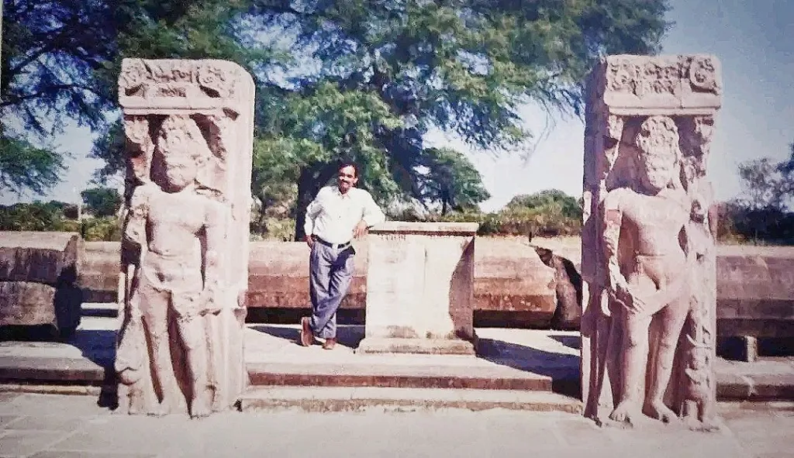
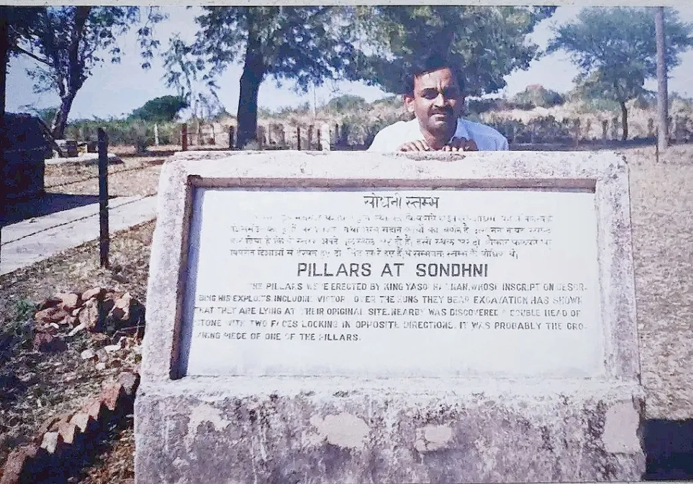
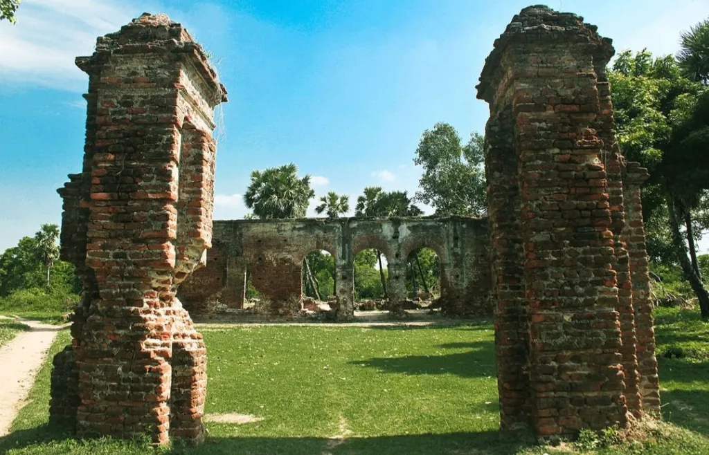
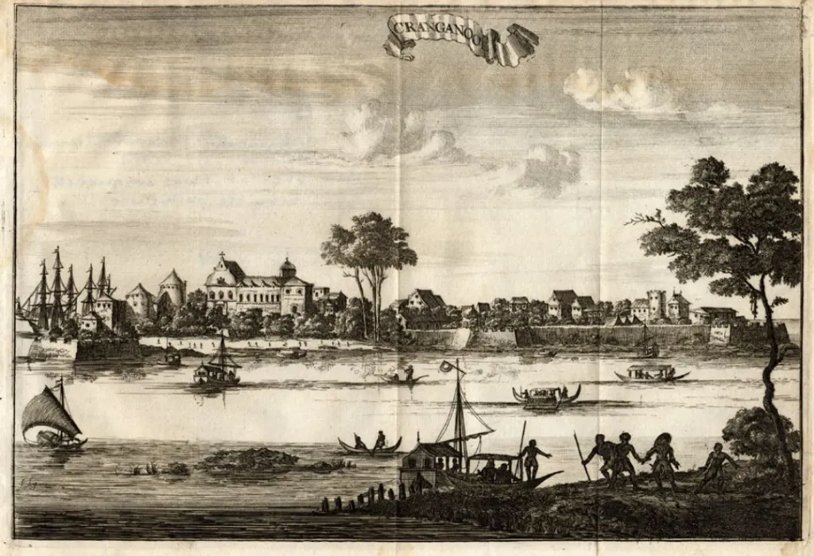
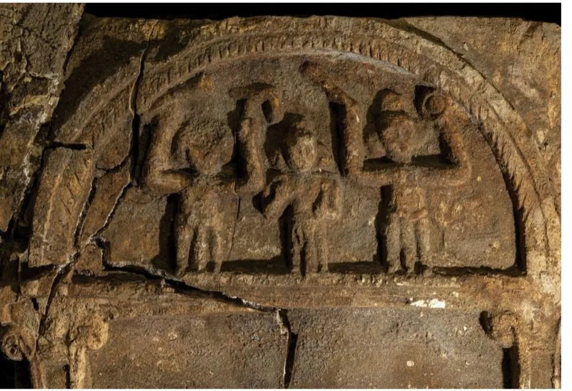

---
date : "2024-06-28T20:00:00+00:00"
draft : false
title : "The Lost City: Treasures from India's past"
tags: ['Civilization','Hinduism','Indian Culture']
categories : ['History','Non Fiction']
---

In childhood, I read and enjoyed many stories of lost cities that would be filled with treasure.

As I grew up those memories faded and I knew that there were no lost cities filled with treasure. Life was humdrum and filled with the daily grind of practicality.

But there are lost kingdoms and cities full of treasure and I got a glimpse of that when I stumbled upon Sondhini.

In the early nineties, India was just waking up to its strengths and its ancient heritage. I was posted in Madhya Pradesh and Mandsaur was part of my area of operations.

On one visit I was told about the pillars of Sondhini at Mandsaur. And I went to see them. 

The pillars of Sondhini, 1993 and me.😊

There were ruins of temples and other structures all that remained intact were two pillars.

There was no one around and it was in a dilapidated condition.

The inscriptions talked about King Yashovardhan who ruled an Empire that stretched from Assam to the Arabian Sea. A huge empire.

No one could tell me much about Sondhini.

I became busy with my work and family but those pillars were always in my mind. I was not much into history, I was a young man interested in my new bride and the adventures that a traveling job entailed.

Madhya Pradesh was very backward and it was like traveling back in time. We stayed in British-built Dak bungalows and roamed through poppy fields. But more of that in some later blogs. Let us just say that I started becoming more aware of my land and its antiquity.

As I traveled through India, with my frequent transfers, I began to get a sense of a vast and ancient land and a civilization that has a common thread even now.

Long lonely drives through deserted roads gave me time to reflect, the glimpses of ruins, and the stories around the campfire sparked my interest further.

Aurangabad was a dream. I had been there earlier as a casual visitor but the posting there for three years exposed me further to the wonders of our ancient land.

And then Pondicherry where the ruins of Arikamedu showed me another facet of our land and civilization, trading with the world.

We were not the isolated pagans that we had been classified as by the British and the Westerners. We were not discovered by them.

Arikamedu

We were well-known people with a distinct identity  and a civilization respected, and honoured around the known world while Europe was still the abode of pagan tribes.

And then I came to Kerala, and the mysterious Muziris. The fabled port was written about in the Sangam literature and many other writings of that period. We are talking about a port that flourished over 2000 years ago.

Muziris is an enigma, it was a well-known port, the centre, and the hub of trading in the world then. It was the link between Rome, Greece, Egypt the Eastern world, and China.

Goods and gold came from the western world, from Rome through Egypt and from there ships brought it to Muziris. Then the goods would travel inland to ports like Poompuhar or Arikamedu on India’s eastern coast and be shipped further east and to China.

Similarly goods would come from China and the east, move to Muziris, and then ships would take them to ports like Berenike in Egypt and then overland to Rome. The Romans levied a fee of 20 percent on the trade and the wealth of the Roman Empire came from this trade.

But where is Muziris the fabled port on the Arabian Sea? Now that’s still a point of argument between scholars. Some say it was at Kodungallur which is a temple town to the north of Cochin. An hour’s drive from here.

Others claim it was at Pattanam which is at North Paravur. The latest excavations seem to indicate that Pattanam, a sleepy village on the banks of Kanjripuzha, was the site of the fabled port and trading center of ancient India.

Kodganallur or Cranganore as it was called by the British.

Recent excavations at the Roman port of Berenike in Egypt have discovered ancient writings in Sanskrit that talk about an Egyptian king. They have also found a frieze with the images of Hindu deities Krishna and Balarama. 

The frieze found at the Roman port of Berenike showing Krishna with his Sudarsan Chakra and Balarama with his plough.

New discoveries all tend to prove that India was a land with a common civilization which interacted around the world.

We are people with a vibrant civilization that goes back thousands of years, the collective memory of that now stirs in us as we face the challenges of this new world.

Namaste until the next time. 🙏

