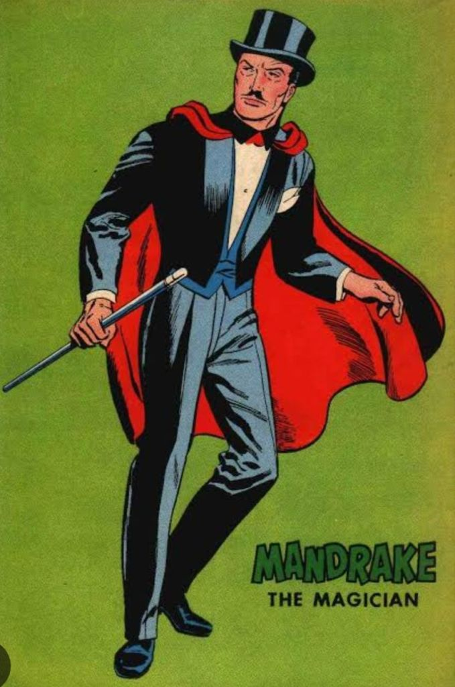
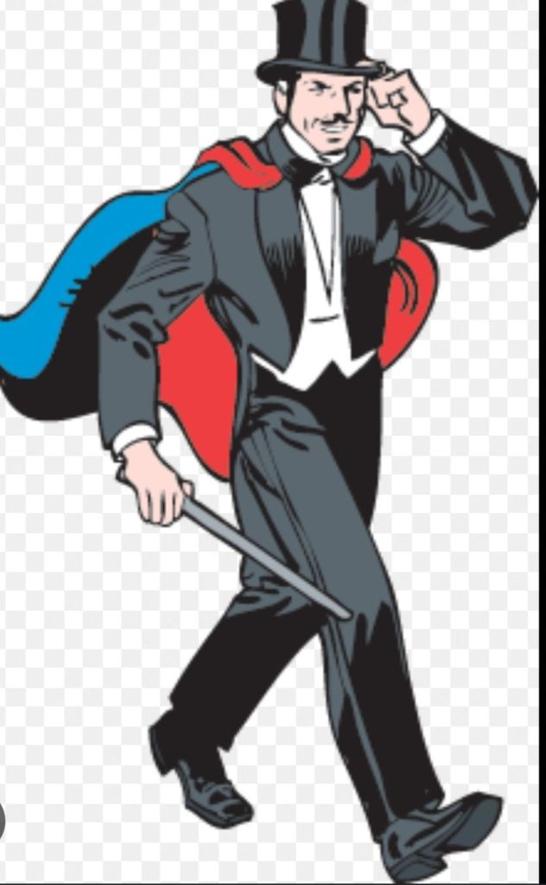

---
date : "2024-03-17T20:00:00+00:00"
draft : false
title : "The world’s first Superhero!"
tags: ['Superhero','Culture', 'Adventure', 'Escapisim']
categories : ['Entertainment','Comics', 'Fiction','Magic']
---

America has been a dominant superpower for a long time. We all looked up to America as we were growing up. That dominance is now being eroded. But in one area America still is unchallenged and that is the world of comics.

Comics were fun to read, racy, and thrilling, with simple plots and colorful.

In the vast and colorful universe of comic books, Mandrake the Magician stands as a timeless figure, captivating readers with his enigmatic charm and extraordinary abilities. Created by Lee Falk, Mandrake made his debut in 1934, making him the earliest of superheroes in comic history. Stan Lee, the superhero of Comic creators calls him the first superhero.

Mandrake with his top hat, Cape, and that pencil moustache stood out in the crowd. With his hypnotic gaze and mastery over the arcane arts, Mandrake quickly became a beloved icon, paving the way for a rich legacy that continues to enchant audiences to this day. Dr. Strange is but a pale shadow of Mandrake the Magician.

The world would be in danger and everything would seem lost but then “Mandrake gestured hypnotically” and everything would be fine.

Sometimes when faced with a difficult situation like a poor report card or being caught in some mischief, I pretended to be Mandrake and gestured hypnotically at the doom rushing upon me. But my Dad was immune to hypnosis and I duly received my punishment.

I dreamt of being like Mandrake when I grew up and years later bought a magic kit when we visited a fair, me, my wife, and kids. I tried those tricks on my kids but they soon read the attached book and became better than me.

But they too began to read my old comics and soon the kids were gesturing hypnotically at me. 😲

## The Origins of Mandrake:

Mandrake’s origins are as mysterious as his powers. Born Leon Mandrake, he discovered his extraordinary abilities while studying in Tibet under the guidance of a powerful sorcerer named Theron. It later turns out Theron is his father.

It was during his time in Tibet that Mandrake honed his skills in hypnosis, illusion, and telepathy, eventually becoming the world’s foremost stage magician. However, Mandrake’s talents extended far beyond mere entertainment; he utilized his powers to combat crime and villainy, earning him the moniker of “The Magician Detective.”

Adventures Across the Globe:

One of the defining aspects of Mandrake the Magician comics is the globetrotting nature of his adventures. From the bustling streets of New York City to the remote corners of the Amazon rainforest, Mandrake’s exploits take him to every corner of the Earth and beyond. Alongside his trusty companion Lothar, a formidable strongman hailing from the African nation of Kalimantan, Mandrake faces off against a colorful rogues’ gallery of adversaries, ranging from mad scientists to ancient sorcerers.

The villains he faced were as iconic as Mandrake. The Cobra was a favorite of mine, as also the clay camel. The alluring Aleena was a student with Mandrake in the College of Magic but sadly her appearance was rare.

## The Power of Illusion:

What truly sets Mandrake apart from other comic book heroes is his mastery over illusion and hypnosis. With a mere gesture or a whispered command, Mandrake can bend reality to his will, creating elaborate illusions to confound his enemies or compel them to do his bidding. This unique power adds an element of mystery and intrigue to his adventures, as readers are constantly left guessing what is real and what is merely a product of Mandrake’s magic.

## Legacy and Influence:

Over the years, Mandrake the Magician has left an indelible mark on popular culture, inspiring countless adaptations across various media. From radio serials to television shows and even a feature film, Mandrake’s legacy continues to thrive in the hearts and minds of fans around the world. His timeless appeal lies in his ability to blend the worlds of magic and mystery, offering readers an escape into a realm where anything is possible.

## Conclusion:

In a world filled with superheroes and larger-than-life characters, Mandrake the Magician stands out as a true original. With his suave demeanor, dazzling illusions, and unwavering sense of justice, Mandrake continues to captivate audiences, proving that the power of magic knows no bounds. As we embark on new adventures alongside this enigmatic hero, one thing remains certain: wherever there is danger, Mandrake will be there, ready to weave his spell and save the day.

How wonderful it would be to gesture hypnotically and get rid of our worries. 😀.

