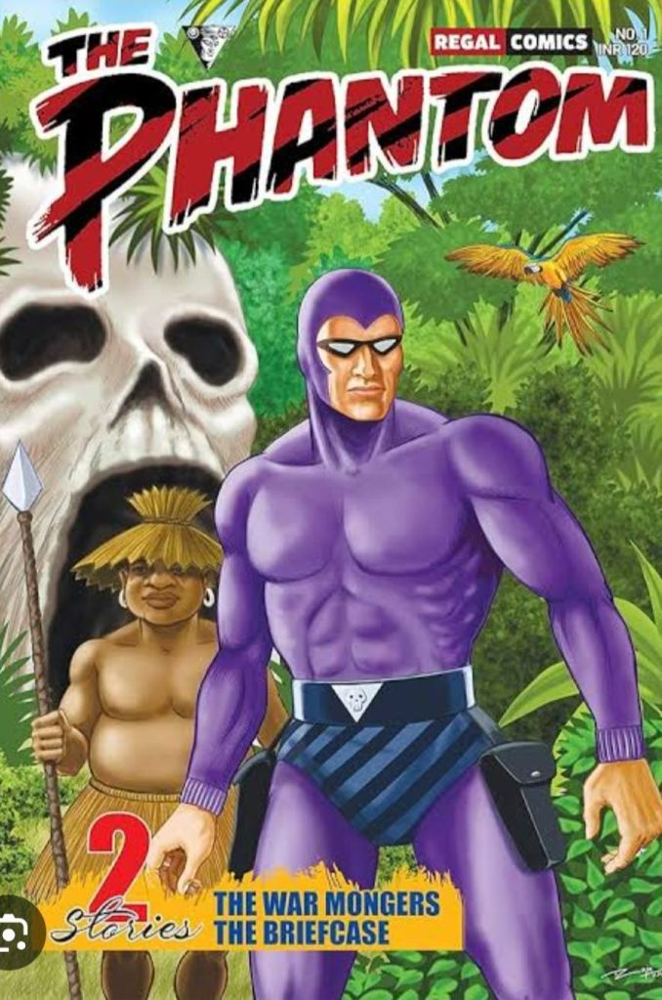

Ah, gather around, dear friends, for a tale as old as time (well, almost): the enigmatic and evergreen legend of The Phantom! Created by the ingenious Lee Falk, this masked marvel has swung through the jungles of pop culture for decades, leaving a trail of intrigue, humor, and one heck of a fashion statement in his wake.

Imagine a well-muscled grim-looking man in spandex tights of violent purple. His eyes have no pupils and above all he wears his underwear over his tights! A black striped underwear! Would you in your wildest dreams imagine this man would not only become an iconic, much-loved superhero but also still going strong after nearly 90 years? Superheroes may come and go but the Phantom remains my favorite even today after all these decades.

The Phantom was the first to start a fashion trend among superheroes. Spandex suits and wearing your underwear visible to all.

Origin stories are always a hoot, aren’t they? Picture this: it’s 1936, and Falk, armed with wit and a penchant for adventure, conjures up The Phantom, a costumed crimefighter with a lineage as rich as his purple tights.

Born Kit Walker, our hero inherits the mantle of The Phantom from his ancestors, each donning the iconic skull ring and crusading against evil with a dash of swashbuckling charm. It’s like a family tradition but with fewer awkward holiday dinners and more vanquishing villains.

But why the purple tights and blue-black underwear? Well, color printing was still in its infancy. Mostly only the cover pages would be in color and you could have a maximum of four colors. There was also the chance of color bleeding so you needed thick lines. So viola, the tights show the muscles, the underwear stands out and defines the buttock, and lets the Phantom wear a belt with the skull motif and hang his guns ready.

Today all your self-respecting superheroes wear their underwear outside. It has become a fashion statement.

Now, let’s talk evolution. Like a fine wine (or a good cheese, if you prefer), The Phantom has aged gracefully over the years, adapting to the ever-changing landscape of entertainment while still retaining its timeless appeal. From comic strips to radio dramas, animated series to feature films, The Phantom has ridden across various mediums with the grace of, well, a masked vigilante.

But what keeps The Phantom relevant in a world teeming with caped crusaders and spandex-clad saviors? It’s simple, really: his versatility. While other heroes may rely on flashy gadgets or superhuman abilities, our dear Phantom wields something far more powerful: wit. Yes, you heard me right. Beneath that mask lies a quick wit and a dry sense of humor, serving up quips and puns alongside justice. Who needs a Bat-Signal when you’ve got punchlines?

Growing up reading The Phantom Comics published by Indrajal, the Phantom to us kids, was not a dark crusader. He was a kind and benevolent in our eyes. The Phantom walking into a tough bar, looking straight into the bartender’s eyes and asking for milk! It was a macho statement that spoke to us.  So cool was that, what confidence to step into a tough bar and still be yourself. The Phantom’s message was clear and loud, be yourself.

Let’s not forget the impact of The Phantom on pop culture. Like a stealthy shadow in the night, he’s left his mark on everything from comic books to fashion (seriously, purple spandex is making a comeback, mark my words). His influence knows no bounds, inspiring countless creators and leaving an indelible imprint on the superhero genre as a whole.

And oh, the spin-offs! TV shows, movies, even a stage musical (yes, you read that correctly). The Phantom has graced screens big and small, his adventures captivating audiences and proving that even after all these years, he’s still got it.

He is grim-looking and lives in a skull cave. He is muscled and carries two guns. But he is soft-spoken. He cares for the denizens of the forest including the wild ones, and has his sanctuary called Eden, a haven for rescued wild animals, including the Gorilla Baldy. All this before conservation became cool and trendy. And his horse Hero and “he is not a dog, he is a wolf, Devil, his sidekicks in fighting villains.

The Phantom is macho but he is also a modern man respecting his wife Diana’s choices and tries his best to facilitate her work and build a career. No wonder the ladies too love him.

He has such unique aliases, as The Ghost who Walks, and Guardian of the Eastern Dark.

So, dear friends, the next time you find yourself in need of a hero, look no further than The Phantom. With a nod to the past and a wink to the future, he’ll swing into action, armed with puns, panache, and a skull ring that’s the envy of masked vigilantes everywhere. Truly, he’s a legend for the ages.

