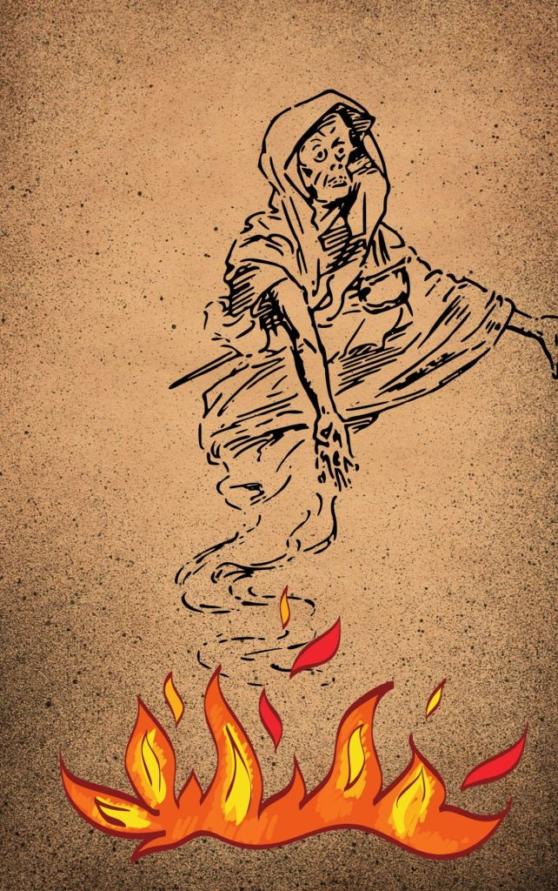

---
date : "2024-05-30T20:00:00+00:00"
draft : false
title : "Why do we cremate our dead in Hinduism."
tags: ['Hinduism','Indian Culture']
categories : ['Non Fiction','Religion']
---

Funerals are grim and a time of grief for many. Religion tries to reduce grief in many ways. The rituals associated with funerals are one of the methods to get the living to leave their grief behind and get in with their life.

In Hinduism, reincarnation is a core concept, and the aim of life is to attain moksha freedom from this cycle of rebirth.

Our ancestors understood change was difficult especially when we had no information about where we were going. That meant the soul would hang around the mortal body it had occupied for so long.

This would impede the journey that the soul needed to take. So cremation was a method to destroy the mortal body completely and return it to the elements it was formed of. So the body was burnt and the ashes immersed in water.

There were other more practical aspects. Fire was a cleansing agent that would destroy almost anything. In Hinduism fire is purifying all your sins get destroyed in the fire. Also, many deaths could have been caused by an infectious disease and fire would destroy the source of infection thus protecting the living.

When you cremate and then scatter the ashes you do not leave anything physical for the living to brood over. It was a way for the living also to get over their grief and move on.

Cremation frees the soul

No visits to a graveyard, no memorial flowers on a grave, no gravestone, and no need for land to bury the dead. The dead lived in our memories and the land could be used for other purposes. The cost of maintenance of burial grounds, embalming, gravestones, etc was also avoided.

But why do Hindus bury Children below five years old and sadhus? It is because the child has not yet had time to get attached to the mortal body and the Sadhus have already given up material things including family.

Cremation is now getting popular with many people who are not Hindus as it does away with the expenses involved in lengthy burial rituals, the cost of a coffin and land. People who are not Hindus and yet cremate do not follow the rituals of Hinduism so that cost is also not there.

With electric crematoriums and gas based crematoriums the process is quicker, cheaper and more eco-friendly.
Namaste until the next time. 🙏

